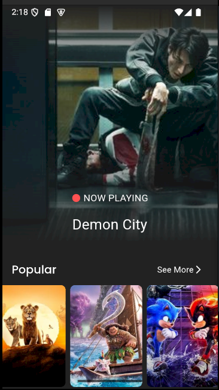
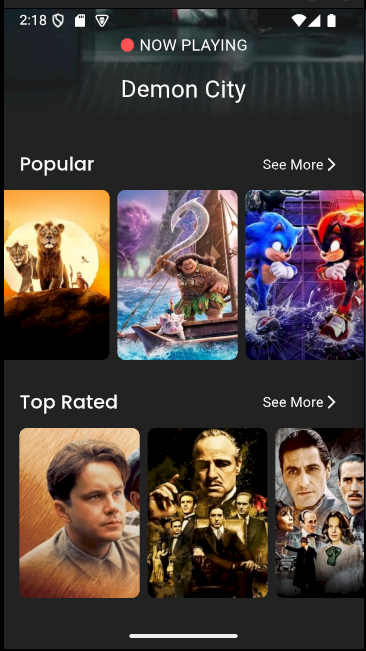
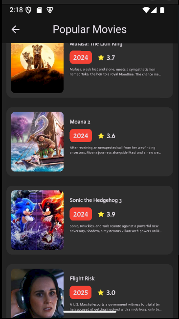
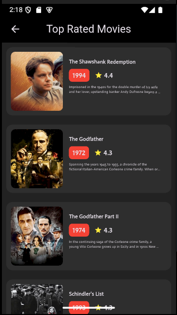
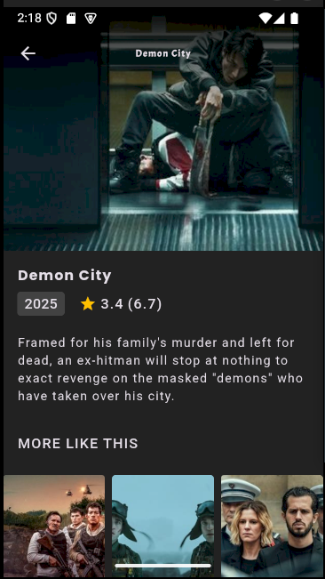
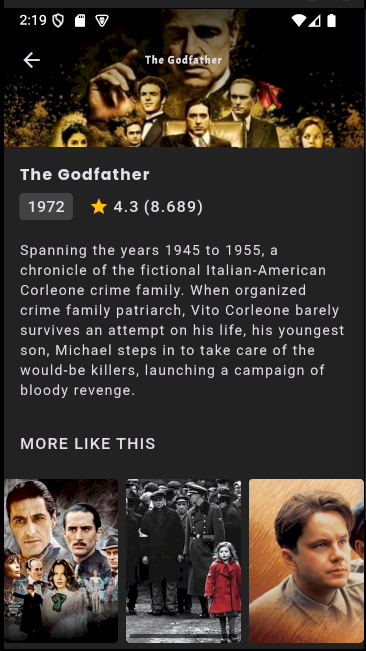

# MovieApp - Flutter Movie Application 🎬✨


## 🎥 App Showcase

### 🎮 Video Demonstration
[🎥 Watch App Demo](https://drive.google.com/file/d/1_I_xSI6Tzy_4Mu-VwSR8UkGvKlmnUFZG/view?usp=sharing)
### 📱 Screenshots
<p align="center">
  
  
  
  
  
  
</p>

##  Project Overview

MovieApp is a Flutter-based application that provides users with a comprehensive movie database experience. It fetches data from **The Movie Database (TMDb)** API and displays information about now-playing movies, popular movies, and top-rated movies. Users can explore movie details, view recommendations, and enjoy a seamless user interface.

### 🔑 Key Highlights
- 🎬 **Now Playing Movies**: Displays the latest movies currently playing in theaters.
- 🍿 **Popular Movies**: Shows a list of the most popular movies.
- ⭐ **Top-Rated Movies**: Displays the highest-rated movies.
- 📖 **Movie Details**: Provides detailed information about a movie, including its overview, release date, runtime, and genres.
- 🤖 **AI-Powered Recommendations**: Suggests similar movies based on the selected movie.
- 🛠️ **Modern UI**: Clean and responsive user interface for a smooth experience.
- 🛡️ **Real-Time API Integration**: Fetches live movie data seamlessly.
- 💡 **Clean Architecture & Code**: Follows best practices for maintainability and scalability.

## 🛋️ Technical Specifications

| Aspect | Details |
|--------|---------|
| **Framework** | Flutter |
| **State Management** | Bloc |
| **Architecture** | Clean Architecture (MVVM) |
| **API Handling** | Dio |
| **Movie Data Source** | [The Movie Database (TMDb)](https://www.themoviedb.org/) |
| **Dependency Injection** | GetIt |
| **Animations** | Lottie |
| **Caching** | Cached Network Image |

## ✨ Features

- 🎬 **Now Playing Movies**
- 🍿 **Popular Movies**
- ⭐ **Top-Rated Movies**
- 📖 **Detailed Movie Information**
- 🤖 **Movie Recommendations**
- 🌐 **Beautiful & Intuitive User Interface**
- 🔄 **Real-Time Data Updates**

## 🛠️ Getting Started

### Prerequisites
- Flutter SDK
- Dart SDK
- Android Studio or VS Code

### Installation
1. Clone the repository
```bash
git clone https://github.com/Maheresio/movies_app.git
```

2. Install dependencies
```bash
flutter pub get
```

3. Run the app
```bash
flutter run
```

## 🤝 Technology Stack & Dependencies
- **Flutter**
- **Dart**
- **Bloc (State Management)**
- **Dio (API Handling)**
- **GetIt (Dependency Injection)**
- **Lottie (Animations)**
- **Cached Network Image (Image Caching)**
- **Shimmer (Loading Effects)**
- **Google Fonts (Custom Fonts)**
- **Carousel Slider (Image Carousel)**
- **Sizer (Responsive UI)**

## 🤝 About the Developer
This project was developed by Ahmed Maher, a passionate Flutter developer focusing on building scalable and user-friendly mobile applications. MovieApp demonstrates skills in:
- API integration
- Clean Architecture & MVVM
- State Management with Bloc
- Clean Code & Best Practices
- UI/UX Optimization

## 🎨 Design Inspiration
- UI/UX Design: Custom-built with modern and minimal aesthetics.

## 💪 Acknowledgments
- Flutter Team
- Dio Package Maintainers
- [The Movie Database (TMDb)](https://www.themoviedb.org/)
- Lottie for Animations
- Contributors & Open-Source Community

## 🙏 Contributing
Contributions, issues, and feature requests are welcome! Feel free to check the [issues page](https://github.com/Maheresio/movie-app/issues).

---

